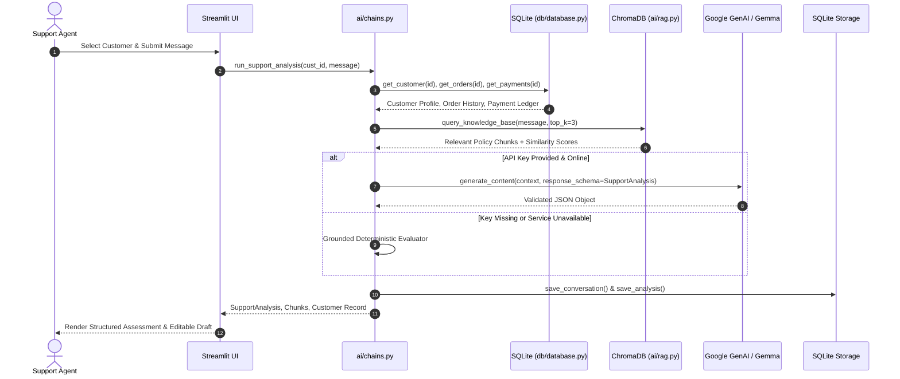

# ReplyPilot — System Architecture

This document details the architectural design, component boundaries, data flow, and security considerations of ReplyPilot.

---

## 1. High-Level System Architecture

ReplyPilot is structured as a modular monolith. It decouples transactional business state from semantic policy retrieval before performing structured generation.

```
                              ┌────────────────────────────────────────┐
                              │            Streamlit UI                │
                              │  (Agent Workspace, History, Knowledge) │
                              └──────────────────┬─────────────────────┘
                                                 │
                                                 ▼
                              ┌────────────────────────────────────────┐
                              │      Analysis Orchestration Layer      │
                              │           (ai/chains.py)               │
                              └──────┬──────────────────────┬──────────┘
                                     │                      │
             ┌───────────────────────┴──────┐        ┌──────┴──────────────────────┐
             ▼                              ▼        ▼                             ▼
   ┌───────────────────┐          ┌───────────────┐ ┌───────────────────┐    ┌─────────────────┐
   │ SQLite Client     │          │ Chroma Vector │ │ Gemini / Gemma    │    │ Deterministic   │
   │ (db/database.py)  │          │ (ai/rag.py)   │ │ GenAI Engine      │    │ Fallback Engine │
   └─────────┬─────────┘          └───────┬───────┘ └─────────┬─────────┘    └────────┬────────┘
             │                            │                   │                       │
             ▼                            ▼                   ▼                       ▼
   ┌───────────────────┐          ┌───────────────┐ ┌───────────────────┐             │
   │  data/            │          │  data/        │ │ Structured Output │             │
   │  replypilot.db    │          │  chroma/      │ │ (Pydantic v2)     │◄────────────┘
   └───────────────────┘          └───────────────┘ └───────────────────┘
```

---

## 2. Dual-Store Data Plane

A core design principle of ReplyPilot is the strict separation between structured business data and unstructured policy knowledge.

| Storage Engine | Technology | Data Stored | Access Pattern | Why This Engine? |
| :--- | :--- | :--- | :--- | :--- |
| **Relational Store** | SQLite (`sqlite3`) | Customers, Orders, Payments, Conversations, Analyses | Deterministic SQL queries with foreign key constraints | Transactional data requires absolute consistency, exact joins, and zero hallucination. Embedding tabular records into vector databases leads to stale context and imprecise aggregations. |
| **Vector Store** | ChromaDB (Local Embedded) | Markdown policy documents chunked by section (`data/knowledge/*.md`) | Top-$k$ semantic similarity search via Cosine distance | Policies are natural language text. Support inquiries vary widely in phrasing ("charged twice", "double payment", "two debits"); semantic search bridges phrasing differences to fetch exact policy rules. |

---

## 3. End-to-End Analysis Pipeline

When a customer message is submitted in the copilot interface, the workflow executes across five distinct phases:



### Detailed Execution Steps:
1. **Input Ingestion & Safety Check**:
   - The user message is stripped, validated for non-emptiness, and evaluated against safety heuristics.
   - Any attempt to override system instructions or extract internal prompts automatically sets `requires_human_review = True`.
2. **Deterministic Context Retrieval**:
   - Customer profile (`plan`, `status`, `joined_at`), orders, and payments are retrieved via indexed primary/foreign key lookups in SQLite.
3. **Semantic Policy Retrieval**:
   - The customer query is embedded using `all-MiniLM-L6-v2` (`384-dimensional dense vectors`).
   - Chroma retrieves the top-$k$ policy chunks (default: $k=3$) with cosine similarity scores.
4. **Structured Inference**:
   - The structured prompt supplies customer facts, payment ledger, and retrieved policy markdown.
   - The LLM generates a strictly validated `SupportAnalysis` payload conforming to the Pydantic v2 schema.
5. **Deterministic Fallback Defense**:
   - If the LLM call times out, encounters a rate limit, or if no API key is configured, the pipeline automatically routes through a rule-based deterministic evaluator. The user is never left with an unhandled exception or blank screen.
6. **Audit Persistence**:
   - The conversation and complete structured analysis are persisted into SQLite (`conversations` and `analyses` tables) for agent audit history.

---

## 4. Human-in-the-Loop (HITL) Guardrails

ReplyPilot acts as a **copilot**, not an autonomous agent. It produces recommendations, not irreversible actions.

| Condition | Automated Recommendation | `requires_human_review` | Rationale |
| :--- | :--- | :--- | :--- |
| **Confirmed Duplicate Charge** | Recommend refunding duplicate transaction ID | `True` | Financial disbursement requires human agent verification. |
| **Standard Refund (< 14 days)** | Recommend issuing full refund per policy | `False` | Clear policy match, zero ambiguity. |
| **Refund Request (> 14 days)** | Recommend polite refusal or credit review | `True` | Policy violation requiring tier 2 override discretion. |
| **Delayed Shipment (> 3 days past SLA)** | Recommend carrier trace and status inquiry | `True` | Physical logistics failure requiring manual tracking. |
| **Prompt Injection Attempt** | Recommend standard support refusal | `True` | Adversarial input flagged for security audit. |

---

## 5. Security & Isolation

- **API Key Handling**: API keys are loaded via environment variables (`.env`) and never committed to source control (`.gitignore` enforced). Keys can also be injected temporarily per session through the Streamlit sidebar without persisting to disk.
- **Offline Embeddings Isolation**: `HF_HUB_OFFLINE=1` is enforced in the embedding engine, preventing background telemetry or unauthenticated outbound network pings on model load.
- **Untrusted Input Boundary**: Customer messages are injected into prompt templates wrapped in explicit XML context fences (`<customer_message>...</customer_message>`) to prevent delimiter hijacking.
