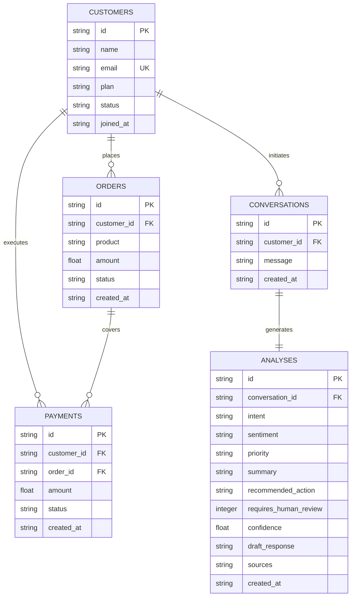

# ReplyPilot — Database Schema & Data Models

ReplyPilot utilizes SQLite as its transactional data store (`data/replypilot.db`). This document outlines the schema, relationships, and queries used across the system.

---

## 1. Entity-Relationship Diagram



---

## 2. Table Definitions

### `customers`
Stores customer profile attributes, plan subscription tiers, and account status.
```sql
CREATE TABLE IF NOT EXISTS customers (
    id TEXT PRIMARY KEY,
    name TEXT NOT NULL,
    email TEXT NOT NULL UNIQUE,
    plan TEXT NOT NULL,          -- 'Starter', 'Pro', 'Enterprise'
    status TEXT NOT NULL,        -- 'active', 'delinquent', 'cancelled'
    joined_at TEXT NOT NULL
);
```

### `orders`
Stores physical and digital purchases linked to a customer.
```sql
CREATE TABLE IF NOT EXISTS orders (
    id TEXT PRIMARY KEY,
    customer_id TEXT NOT NULL,
    product TEXT NOT NULL,
    amount REAL NOT NULL,
    status TEXT NOT NULL,        -- 'delivered', 'shipped', 'processing', 'cancelled'
    created_at TEXT NOT NULL,
    FOREIGN KEY (customer_id) REFERENCES customers(id)
);
```

### `payments`
Stores billing transactions and payment statuses. Enables detecting duplicate transactions or failed billings.
```sql
CREATE TABLE IF NOT EXISTS payments (
    id TEXT PRIMARY KEY,
    customer_id TEXT NOT NULL,
    order_id TEXT NOT NULL,
    amount REAL NOT NULL,
    status TEXT NOT NULL,        -- 'succeeded', 'failed', 'refunded'
    created_at TEXT NOT NULL,
    FOREIGN KEY (customer_id) REFERENCES customers(id),
    FOREIGN KEY (order_id) REFERENCES orders(id)
);
```

### `conversations`
Tracks raw inbound customer support messages.
```sql
CREATE TABLE IF NOT EXISTS conversations (
    id TEXT PRIMARY KEY,
    customer_id TEXT NOT NULL,
    message TEXT NOT NULL,
    created_at TEXT NOT NULL,
    FOREIGN KEY (customer_id) REFERENCES customers(id)
);
```

### `analyses`
Maintains an immutable audit log of every copilot generation, including structured assessments, human review flags, and grounded draft responses.
```sql
CREATE TABLE IF NOT EXISTS analyses (
    id TEXT PRIMARY KEY,
    conversation_id TEXT NOT NULL,
    intent TEXT NOT NULL,
    sentiment TEXT NOT NULL,
    priority TEXT NOT NULL,      -- 'low', 'medium', 'high'
    summary TEXT NOT NULL,
    recommended_action TEXT NOT NULL,
    requires_human_review INTEGER NOT NULL,  -- 0 (False) or 1 (True)
    confidence REAL NOT NULL,
    draft_response TEXT NOT NULL,
    sources TEXT NOT NULL DEFAULT '[]',       -- JSON-encoded string array
    created_at TEXT NOT NULL,
    FOREIGN KEY (conversation_id) REFERENCES conversations(id)
);
```

---

## 3. Seed Accounts

ReplyPilot includes 4 seeded realistic customer profiles in `db/seed.py`:

| Customer ID | Name | Plan | Status | Seed Scenario Purpose |
| :--- | :--- | :--- | :--- | :--- |
| `CUST-001` | Alex Johnson | Pro ($49/mo) | Active | **Duplicate charge scenario**: Two identical payments of $49 for order `ORD-1001` within 4 minutes. |
| `CUST-002` | Sarah Miller | Pro ($49/mo) | Active | **Valid 14-day refund scenario**: Purchased 6 days ago, eligible for standard refund. |
| `CUST-003` | Marcus Vance | Starter ($19/mo) | Active | **Cancellation scenario**: 8 months active subscriber requesting cancellation and data export. |
| `CUST-004` | Elena Rostova | Enterprise ($299/mo) | Active | **Delayed shipment scenario**: Hardware Security Hub order `ORD-1004` stuck in transit > 7 days. |

---

## 4. Query Patterns

All database transactions use `sqlite3.Row` for dictionary-style column access and enforce `PRAGMA foreign_keys = ON;`.

### Lookup Customer Context (Single Call)
```python
customer = get_customer("CUST-001")
orders = get_customer_orders("CUST-001")
payments = get_customer_payments("CUST-001")
```
Deterministic SQL lookups ensure zero hallucination of customer balances, invoice IDs, or plan types.
